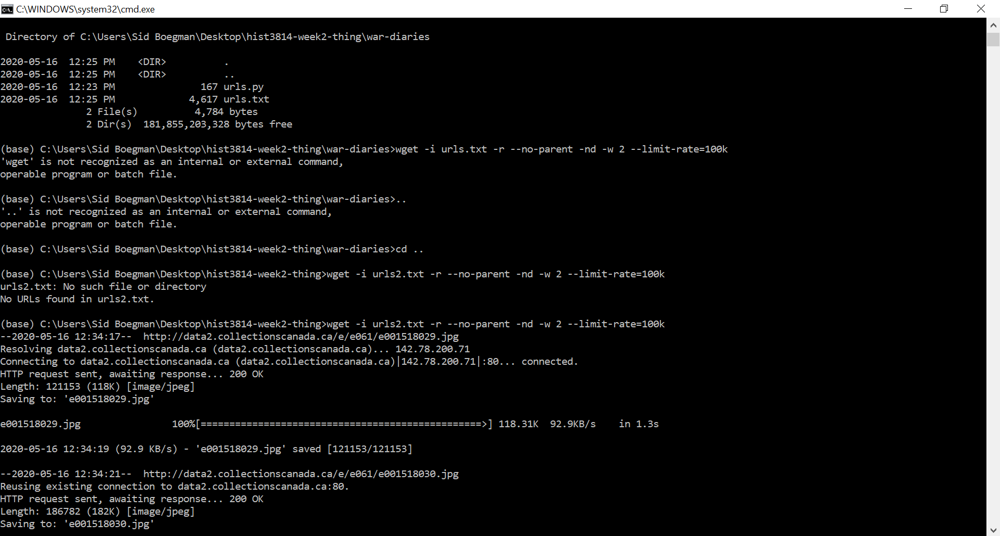

# New terms, alphabetical:
* Anaconda: a platform for data science work (partner says: it lets you plug-and-play different tools)
* ALTO XML: the positioning of words on a page
* API: Application Programming Interface; a way of opening up a program so that another program can interact with it
* Bin: From BINary -- A name for directories that contain files stored in binary format-- computer-readable but not human-readable files
* Command line: a text interface for your computer; a program that takes in commands, which it passes on to the computer's operating system to run
* Echo: a command that outputs the strings it is being passed as arguments
* Flags: a value that acts as a signal for a function or process. The value of the flag is used to determine the next step of a program
* Jupyter: a non-profit, open-source project, born out of the IPython Project in 2014 as it evolved to support interactive data science and scientific computing across all programming languages
* JSON: JavaScript Object Notation; an open standard file format and data interchange format that uses human-readable text to store and transmit data objects consisting of attribute–value pairs and array data types (or any other serializable value)
* Loop: an instruction that repeats until a specified condition is reached
* MediaWiki: a free and open-source wiki engine. It was developed for use on Wikipedia in 2002, and given the name "MediaWiki" in 2003
* METS files: bibliographical information, technical information about the digitisation process and rights information
* Python: an interpreted, high-level, general-purpose programming language
* R: a language and environment for statistical computing and graphics
* RSS: Really Simple Syndication/Rich Site Summary
* Variable: a variable is a value that can change, depending on conditions or on information passed to the program
* Wget: a program for downloading materials from the web (we are using this program on the command line)
* Working directory: the working directory of a process is a directory of a hierarchical file system, if any,[nb 1] dynamically associated with each process. It is sometimes called the current working directory (CWD) or just current directory

# _Some_ of the commands (the ones I feel like I have a pretty solid handle on) I learned this week, out of context:
* **pwd** means print the working directory (use this to find a file path) 
* **dir** means "directory"; to see what’s inside the folder (Note: this is PC-specific – on a Mac it would be ls)
*	**cd [insert subfolder here]** can be used to change/go into a directory (Ex: cd music)
* **cd ..** is used to go back up a level (JUST 2 DOTS NOT AN ELLIPSES)
* **mkdir** is used to make a new directory
* **-r** means recursive
* **-np** means no-parent
* **-i** links beyond the domain you started in
* **-w** means wait time between requests to the server
* **--limit-rate=** will limit the bandwidth for our request (which necessarily slows down how long it’ll take to perform the request) (Ex: --limit-rate=20k) 

# Resources that helped me this week:
* https://craftingdh.netlify.app/week/2/instructions/
* https://craftingdh.netlify.app/week/2/installing-anaconda/
* https://craftingdh.netlify.app/week/2/wget/
* https://craftingdh.netlify.app/week/2/apis/
* https://en.wikipedia.org/wiki/RSS
* https://www.codecademy.com/articles/command-line-commands
* https://en.wikipedia.org/wiki/JSON 
* https://programminghistorian.org/en/lessons/creating-apis-with-python-and-flask
* https://www.youtube.com/watch?v=HYZ215Ref48 
* https://en.wikipedia.org/wiki/MediaWiki 
* https://en.wikipedia.org/wiki/Echo_(command)
* https://techterms.com/definition/flag
* https://jupyter.org/about
* https://www.thoughtco.com/definition-of-loop-958105
* https://en.wikipedia.org/wiki/Python_(programming_language) 
* https://www.r-project.org/about.html
* https://en.wikipedia.org/wiki/Working_directory
* https://www.webopedia.com/TERM/B/bin.html
* https://whatis.techtarget.com/definition/variable
* Week 2 Discord
* My partner (shoutout to their patience with me)

# Thoughts and other notes
* So far, this week is overwhelming so I’m going to need to take some deep breaths
* As a windows user: command prompt = anaconda powershell (aka “$” – but you **DON’T** type this in)
* Command vs Running Program
  + Command: typing “x” at the beginning of the prompt (x = python, conda, etc)
  + Run program: type “x” followed by the program name
  + Ex: python example.py (I think?)
* Files will have an extension (eg, .txt, .doc) while directories won’t
* “You click through, and find the first image of her diary; if you right-click on that image and select view image you find that the file path to the image” => **for windows users, this is _“inspect image”_**
* "#" in (python) code means that you’re explaining something, and won’t actually be coded into your work as part of the program (just something for the next person to use your code to have?)
* Now that I’ve made that “pocket” for my wget work (I guess it’s technically a file folder, but in my mind it’s a pocket where wget works), I have to do everything related to wget in that specific spot or it doesn’t work. I can’t even do it in a folder of within that pocket. For example, when I tried to do the second half of the wget exercise (when we worked with the 14th Canadian General Hospital war diaries), the wget command didn’t work until I renamed my file “url2.txt” (so that I wouldn’t have 2 “url.txt” files in the same folder) and moved it out of the war-diaries directory into my wget pocket
  + For example: 
    
  + Note: Next time, I need to move all the files I’ve already collected out of the wget pocket (the two sets I collected this time are now jumbled together, so I can’t immediately tell which is which)
* On APIs
  + An API will have documentation explaining what or how to “make calls” to it to get the information you want
  + Each API has its own idiosyncracies, so use the documentation to determine how to form your request
* I appreciated this note: Insert image here
* You can change your working directory in R whenever you like, it’s not set in stone
* Note: I accidentally did my first bit of R coding in the console and not in a new script, which meant I couldn’t save it. So I had to c/p it into my text editor and save it as an R file from there.
* I didn’t have time to do the bonus this week, which I’m sad about because I love working with audio. Hopefully, I will have some time to do it in the future!
